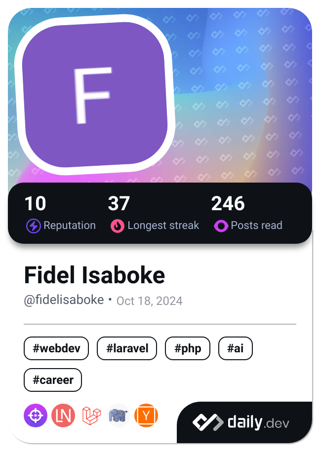

Hi My name is Fidel Isaboke
=====================================================================================================================================

_CS Student | Aspiring Data Scientist | ML & Cybersecurity Enthusiast_

### ⚡ Currently:
- 📚 Learning Python for Data Science & C++ for Competitive Programming
- 🚀 Building a robust Network Intrusion Detection System using adversarial defence techniques
- 🧪 Exploring AI and cybersecurity projects

### 📫 Contact Me
- Email: [fidelisaboke@gmail.com](mailto:fidelisaboke@gmail.com)
- LinkedIn: [@fidel-isaboke](https://www.linkedin.com/in/fidel-isaboke-57aba3263/)

## Skills 

  
  
  
  
  
  
  
  
  
    
  
  
  
  
  
  
  
  
  

                    
## Socials          

      <a href="https://www.github.com/Fidelisaboke" target="_blank" rel="noreferrer">
      <picture>
        <source media="(prefers-color-scheme: dark)" srcset="https://raw.githubusercontent.com/danielcranney/readme-generator/main/public/icons/socials/github-dark.svg" />
        <source media="(prefers-color-scheme: light)" srcset="https://raw.githubusercontent.com/danielcranney/readme-generator/main/public/icons/socials/github.svg" />
        
      </picture>
      </a>
      <a href="https://www.linkedin.com/in/fidel-isaboke-57aba3263/" target="_blank" rel="noreferrer">
      <picture>
        <source media="(prefers-color-scheme: dark)" srcset="https://raw.githubusercontent.com/danielcranney/readme-generator/main/public/icons/socials/linkedin-dark.svg" />
        <source media="(prefers-color-scheme: light)" srcset="https://raw.githubusercontent.com/danielcranney/readme-generator/main/public/icons/socials/linkedin.svg" />
        
      </picture>
      </a>

## My GitHub Stats

  
  

<b>Top Repositories</b>
<table>
  <tr>
    <td>
      
    </td>
    <td>
      
    </td>
  </tr>
  <tr>
    <td>
      
    </td>
    <td>
      
    </td>
  </tr>
</table>

 

<!-- ## DevCard

  

 -->
